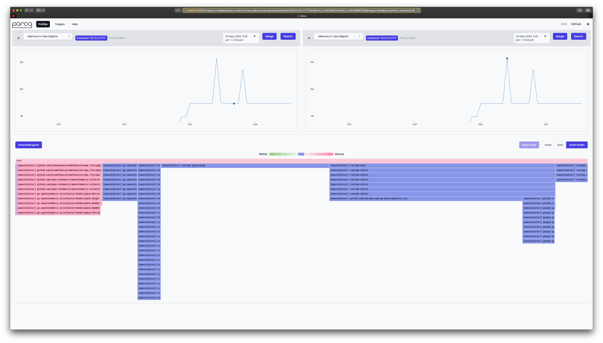

# Good practices operating OpenTelemetry collectors

> Author: Michael Hausenblas
>
> Contact: `mh9@o11y.engineering`
>
> Last update: 2022-07-02
> 
> This document describes good practices operating [OpenTelemetry collectors][otelcol]. 
> The target audience for this document includes platform operators and devops/SRE roles 
> that deploy OTel collectors for the telemetry of their workloads, such as containerized
> microservices or on-premises monoliths. 
>
> I assume you have a basic familiarity with OpenTelemetry and cloud native environments
> like Kubernetes or AWS Lambda. Corrections or suggestions are welcome!


## Introduction

TBD.

## Distributions

When it comes to [distributions][otel-distro-main] you have three options:

1. Use the upstream, [pre-built distro][otel-distro-prebuilt]
1. Choose a vendor distro like [ADOT][otel-distro-aws]
1. Roll your own, using `ocb`, the [OpenTelemetry Collector Builder][otel-distro-builder]

Let's have a look at pros and cons for each option:

## Health and Performance Monitoring

The OTel collector provides built-in mechanism for monitoring and troubleshooting. It provides rich telemetry, configurable via the [`service` section in the config][otelcol-config-service]:

```yaml
service:
  telemetry:
    logs:
      level: debug
    metrics:
      level: detailed
      address: 0.0.0.0:8888
...

extensions:
  pprof:
    endpoint: localhost:1777
...

exporters:
  logging:
    loglevel: debug
...
```

### Logs

You can get collector logs, for example, in a Kubernetes setup:

```shell
$ kubectl logs deployment/adot-collector                                                                                                                                                                                                                                                                            2022/07/02 12:21:49 AWS OTel Collector version: v0.19.0
2022/07/02 12:21:49 found no extra config, skip it, err: open /opt/aws/aws-otel-collector/etc/extracfg.txt: no such file or directory
2022-07-02T12:21:49.709Z        debug   awsutil@v0.54.0/conn.go:61      Using proxy address:    {"kind": "exporter", "data_type": "traces", "name": "awsxray", "proxyAddr": ""}
2022-07-02T12:21:49.709Z        debug   awsutil@v0.54.0/conn.go:130     Fetch region from commandline/config file   {"kind": "exporter", "data_type": "traces", "name": "awsxray", "region": "eu-west-1"}
2022-07-02T12:21:49.709Z        debug   awsxrayexporter@v0.54.0/xray_client.go:51       Using Endpoint: %s  {"kind": "exporter", "data_type": "traces", "name": "awsxray", "endpoint": "https://xray.eu-west-1.amazonaws.com"}
2022-07-02T12:21:49.709Z        debug   awsutil@v0.54.0/conn.go:61      Using proxy address:    {"kind": "exporter", "data_type": "metrics", "name": "awsemf", "proxyAddr": ""}
2022-07-02T12:21:49.709Z        debug   awsutil@v0.54.0/conn.go:130     Fetch region from commandline/config file   {"kind": "exporter", "data_type": "metrics", "name": "awsemf", "region": "eu-west-1"}
2022-07-02T12:21:49.709Z        warn    awsprometheusremotewriteexporter@v0.54.0/factory.go:50  Deprecation notice: The AWS PRW Exporter will be removed in the near future, see the README and the CHANGELOG for more information.     {"kind": "exporter", "data_type": "metrics", "name": "awsprometheusremotewrite"}
2022-07-02T12:21:49.709Z        info    service/telemetry.go:107        Setting up own telemetry...
2022-07-02T12:21:49.710Z        info    service/telemetry.go:146        Serving Prometheus metrics {"address": ":8888", "level": "detailed"}
2022-07-02T12:21:49.711Z        info    extensions/extensions.go:42     Starting extensions...
2022-07-02T12:21:49.711Z        info    extensions/extensions.go:45     Extension is starting...   {"kind": "extension", "name": "health_check"}
2022-07-02T12:21:49.711Z        info    healthcheckextension@v0.54.0/healthcheckextension.go:44 Starting health_check extension     {"config": {"Port":0,"TCPAddr":{"Endpoint":"0.0.0.0:13133"},"Path":"/","CheckCollectorPipeline":{"Enabled":false,"Interval":"5m","ExporterFailureThreshold":5}}}
2022-07-02T12:21:49.711Z        info    extensions/extensions.go:49     Extension started.      {"kind": "extension", "name": "health_check"}
2022-07-02T12:21:49.711Z        info    extensions/extensions.go:45     Extension is starting...   {"kind": "extension", "name": "pprof"}
2022-07-02T12:21:49.712Z        info    pprofextension@v0.54.0/pprofextension.go:71     Starting net/http/pprof server      {"config": {"TCPAddr":{"Endpoint":"localhost:1777"},"BlockProfileFraction":0,"MutexProfileFraction":0,"SaveToFile":""}}
2022-07-02T12:21:49.712Z        info    extensions/extensions.go:49     Extension started.      {"kind": "extension", "name": "pprof"}
2022-07-02T12:21:49.712Z        info    extensions/extensions.go:45     Extension is starting...   {"kind": "extension", "name": "zpages"}
2022-07-02T12:21:49.712Z        info    zpagesextension/zpagesextension.go:64   Registered zPages span processor on tracer provider
2022-07-02T12:21:49.712Z        info    zpagesextension/zpagesextension.go:74   Registered Host's zPages
2022-07-02T12:21:49.712Z        info    zpagesextension/zpagesextension.go:86   Starting zPages extension   {"config": {"TCPAddr":{"Endpoint":"localhost:55679"}}}
2022-07-02T12:21:49.712Z        info    extensions/extensions.go:49     Extension started.      {"kind": "extension", "name": "zpages"}
2022-07-02T12:21:49.712Z        info    pipelines/pipelines.go:74       Starting exporters...
2022-07-02T12:21:49.712Z        info    pipelines/pipelines.go:78       Exporter is starting... {"kind": "exporter", "data_type": "traces", "name": "awsxray"}
2022-07-02T12:21:49.712Z        info    pipelines/pipelines.go:82       Exporter started.       {"kind": "exporter", "data_type": "traces", "name": "awsxray"}
2022-07-02T12:21:49.712Z        info    pipelines/pipelines.go:78       Exporter is starting... {"kind": "exporter", "data_type": "metrics", "name": "awsemf"}
2022-07-02T12:21:49.712Z        info    pipelines/pipelines.go:82       Exporter started.       {"kind": "exporter", "data_type": "metrics", "name": "awsemf"}
2022-07-02T12:21:49.712Z        info    pipelines/pipelines.go:78       Exporter is starting... {"kind": "exporter", "data_type": "metrics", "name": "logging"}
2022-07-02T12:21:49.712Z        info    pipelines/pipelines.go:82       Exporter started.       {"kind": "exporter", "data_type": "metrics", "name": "logging"}
2022-07-02T12:21:49.712Z        info    pipelines/pipelines.go:78       Exporter is starting... {"kind": "exporter", "data_type": "metrics", "name": "awsprometheusremotewrite"}
2022-07-02T12:21:49.712Z        info    pipelines/pipelines.go:82       Exporter started.       {"kind": "exporter", "data_type": "metrics", "name": "awsprometheusremotewrite"}
2022-07-02T12:21:49.712Z        info    pipelines/pipelines.go:86       Starting processors...
2022-07-02T12:21:49.712Z        info    pipelines/pipelines.go:90       Processor is starting...   {"kind": "processor", "name": "batch/metrics", "pipeline": "metrics"}
2022-07-02T12:21:49.712Z        info    pipelines/pipelines.go:94       Processor started.      {"kind": "processor", "name": "batch/metrics", "pipeline": "metrics"}
2022-07-02T12:21:49.712Z        info    pipelines/pipelines.go:98       Starting receivers...
2022-07-02T12:21:49.712Z        info    pipelines/pipelines.go:102      Exporter is starting... {"kind": "receiver", "name": "otlp", "pipeline": "traces"}
2022-07-02T12:21:49.712Z        info    zapgrpc/zapgrpc.go:174  [core] [Server #1] Server created  {"grpc_log": true}
2022-07-02T12:21:49.712Z        info    otlpreceiver/otlp.go:70 Starting GRPC server on endpoint 0.0.0.0:4317       {"kind": "receiver", "name": "otlp", "pipeline": "traces"}
2022-07-02T12:21:49.712Z        info    otlpreceiver/otlp.go:88 Starting HTTP server on endpoint 0.0.0.0:55681      {"kind": "receiver", "name": "otlp", "pipeline": "traces"}
2022-07-02T12:21:49.712Z        info    zapgrpc/zapgrpc.go:174  [core] [Server #1 ListenSocket #2] ListenSocket created     {"grpc_log": true}
2022-07-02T12:21:49.712Z        info    pipelines/pipelines.go:106      Exporter started.       {"kind": "receiver", "name": "otlp", "pipeline": "traces"}
2022-07-02T12:21:49.713Z        info    pipelines/pipelines.go:102      Exporter is starting... {"kind": "receiver", "name": "prometheus", "pipeline": "metrics"}
2022-07-02T12:21:49.713Z        info    kubernetes/kubernetes.go:325    Using pod service account via in-cluster config     {"kind": "receiver", "name": "prometheus", "pipeline": "metrics", "discovery": "kubernetes"}
2022-07-02T12:21:49.713Z        info    kubernetes/kubernetes.go:325    Using pod service account via in-cluster config     {"kind": "receiver", "name": "prometheus", "pipeline": "metrics", "discovery": "kubernetes"}
2022-07-02T12:21:49.713Z        debug   discovery/manager.go:275        Starting provider       {"kind": "receiver", "name": "prometheus", "pipeline": "metrics", "provider": "kubernetes/0", "subs": "map[adot-collector-agent:{} ho11y:{}]"}
2022-07-02T12:21:49.713Z        debug   discovery/manager.go:275        Starting provider       {"kind": "receiver", "name": "prometheus", "pipeline": "metrics", "provider": "kubernetes/1", "subs": "map[kubernetes-service-endpoints:{}]"}
2022-07-02T12:21:49.715Z        info    pipelines/pipelines.go:106      Exporter started.       {"kind": "receiver", "name": "prometheus", "pipeline": "metrics"}
2022-07-02T12:21:49.715Z        info    healthcheck/handler.go:129      Health Check state change  {"status": "ready"}
2022-07-02T12:21:49.715Z        info    service/collector.go:220        Starting aws-otel-collector...      {"Version": "v0.19.0", "NumCPU": 2}
2022-07-02T12:21:49.715Z        info    service/collector.go:128        Everything is ready. Begin running and processing data.
...
```

### Metrics

You can get metrics in Prometheus exposition format, for example, in a Kubernetes setup you can forward traffic locally:

```shell
$ kubectl port-forward svc/adot-collector 8888:8888   
```

In a different session:

```shell
$ curl localhost:8888/metrics
# HELP otelcol_exporter_enqueue_failed_log_records Number of log records failed to be added to the sending queue.
# TYPE otelcol_exporter_enqueue_failed_log_records counter
otelcol_exporter_enqueue_failed_log_records{exporter="awsemf",service_instance_id="f4e35993-b0df-4bd4-80ab-554c847f6156",service_version="latest"} 0
otelcol_exporter_enqueue_failed_log_records{exporter="awsprometheusremotewrite",service_instance_id="f4e35993-b0df-4bd4-80ab-554c847f6156",service_version="latest"} 0
otelcol_exporter_enqueue_failed_log_records{exporter="awsxray",service_instance_id="f4e35993-b0df-4bd4-80ab-554c847f6156",service_version="latest"} 0
otelcol_exporter_enqueue_failed_log_records{exporter="logging",service_instance_id="f4e35993-b0df-4bd4-80ab-554c847f6156",service_version="latest"} 0
...
```

If you use Prometheus to scrape the collector and visualize them in Grafana, an [example dashboard][example-dashboard] might look as follows:


### Profiling

You can consume the `pprof` formatted profiles the OTel collector exposes with one of the Continuos Profiling tools (e.g. CNCF Pixie, Parca, Pyroscope).

Using [Parca][parca-bin] with the following configuration stored in a file called `parca.yaml`:

```yaml
debug_info:
  bucket:
    type: "FILESYSTEM"
    config:
      directory: "./tmp"
  cache:
    type: "FILESYSTEM"
    config:
      directory: "./tmp"

scrape_configs:
  - job_name: "default"
    scrape_interval: "2s"
    static_configs:
      - targets: ["127.0.0.1:1777"]
```

You can now run Parca like so (assuming you've done a port-forward for the OTel collector on port `1777` to the machine where you run Parca):


```shell
$ parca --config-path="parca.yaml"
ooooooooo.
`888   `Y88.
 888   .d88'  .oooo.   oooo d8b  .ooooo.   .oooo.
 888ooo88P'  `P  )88b  `888""8P d88' `"Y8 `P  )88b
 888          .oP"888   888     888        .oP"888
 888         d8(  888   888     888   .o8 d8(  888
o888o        `Y888""8o d888b    `Y8bod8P' `Y888""8o

level=info name=parca ts=2022-05-24T13:43:18.645322Z caller=badger.go:100 msg="Set nextTxnTs to 0"
level=info name=parca ts=2022-05-24T13:43:18.64803Z caller=factory.go:49 component=debuginfod msg="loading bucket configuration"
level=info name=parca ts=2022-05-24T13:43:18.648642Z caller=factory.go:49 msg="loading bucket configuration"
level=info name=parca ts=2022-05-24T13:43:18.649058Z caller=server.go:92 msg="starting server" addr=:7070
...

```

When you now open `localhost:7070` in your browser of choice, you should see something like:




## Statefulness

Consider running the collector stateless.

## Security

### VMs

### Kubernetes

## Further references

* [Open Agent Management Protocol (OpAMP) specification][opamp]
* [OpenTelemetry: beyond getting started][otel-beyond-gettingstarted] by _Sergey Kanzhelev_, 01/2020
* [OpenTelemetry Collector & Exporters][containiq-col]


[otelcol]: https://opentelemetry.io/docs/collector/
[otelcol-config-service]: https://opentelemetry.io/docs/collector/configuration/#service
[example-dashboard]: otel-collector-dashboard.json
[otel-distro-main]: https://opentelemetry.io/docs/collector/distributions/
[otel-distro-prebuilt]: https://github.com/open-telemetry/opentelemetry-collector-releases/releases
[otel-distro-aws]: https://github.com/aws-observability/aws-otel-collector
[otel-distro-builder]: https://github.com/open-telemetry/opentelemetry-collector/tree/main/cmd/builder
[parca-bin]: https://www.parca.dev/docs/binary
[opamp]: https://github.com/open-telemetry/opamp-spec
[otel-beyond-gettingstarted]: https://medium.com/opentelemetry/opentelemetry-beyond-getting-started-5ac43cd0fe26
[containiq-col]: https://www.containiq.com/post/opentelemetry-collector-and-exporters
