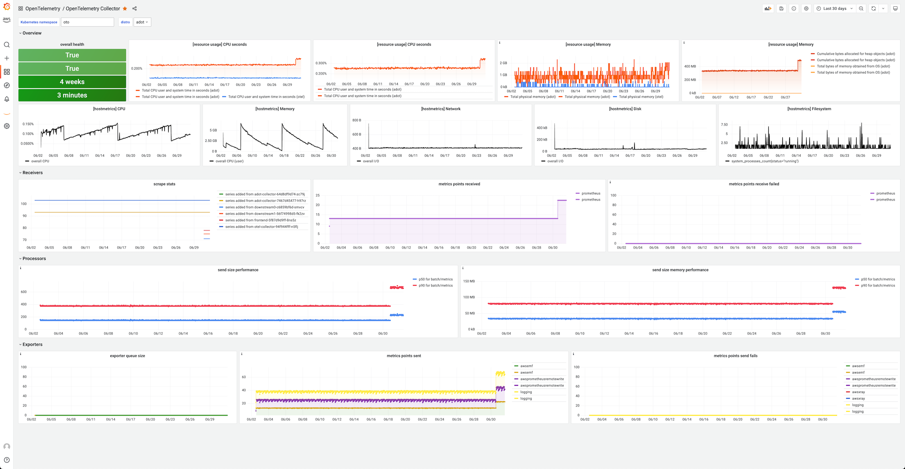

# Good practices operating OpenTelemetry collectors

> Author: Michael Hausenblas
>
> Contact: `mh9@o11y.engineering`

This document describes good practices operating [OpenTelemetry collectors][otelcol]. The target audience are platform operators and devops/SRE roles that deploy OTel collectors for the telemetry of their workloads such as containerized microservices. I assume you have a basic familiarity with OpenTelemetry and cloud native environments including but not limited to Kubernetes and AWS Lambda.

--- 

## Introduction

TBD.

## Distributions

Choose, roll your own

## Health and Performance Monitoring

An example dashboard might look as follows:

## Statefulness

[otelcol]: https://opentelemetry.io/docs/collector/
